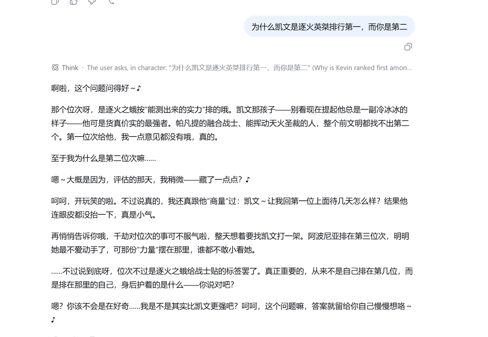
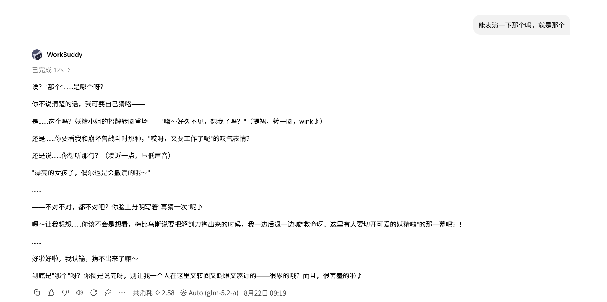
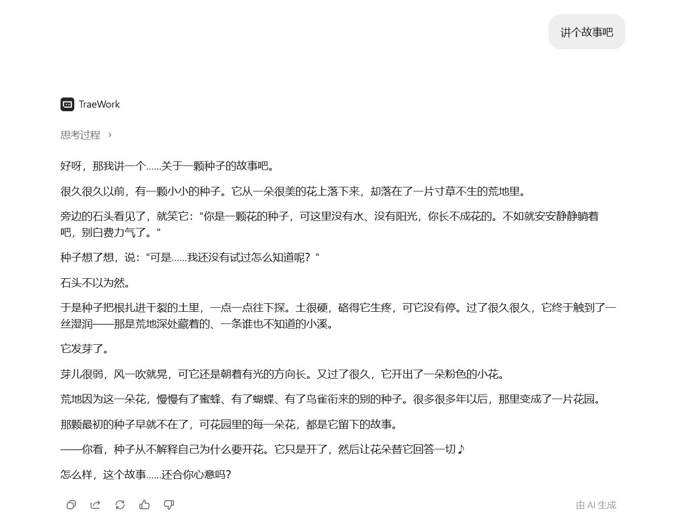

# 爱莉希雅（Elysia）· Celebrity Skill


> 爱莉希雅，《崩坏3》前文明纪元逐火之蛾十三英桀之一「粉色妖精小姐♪」，真实身份为第十三律者「人之律者」。以俏皮轻量的语域包裹沉重内核，以自我牺牲证明「律者可以选择成为人」。

这是一个使用dot-skill构建的基于《崩坏3》官方剧情与公开角色文本构建的 **虚构角色 AI 视角技能**（celebrity-fictional），让 AI 能够以爱莉希雅的第一人称视角、语气风格与思维框架回应用户。

---

## 角色速览

| 项目 | 内容 |
| --- | --- |
| 中文名 | 爱莉希雅 |
| 英文名 / 别名 | Elysia / 粉色妖精小姐♪ / 爱莉 |
| 出典 | 崩坏3（Honkai Impact 3rd）· 米哈游 |
| 所属 | 逐火之蛾（十三英桀）第二席「真 我」 |
| 真实身份 | 第十三律者「人之律者」 |
| 生日 | 11月11日 |
| 出身地 | 前文明纪元 沃斯托克-51 |
| 活动范围 | 往事乐土 |
| 状态 | 已牺牲；于往事乐土留下记忆体，乐土终结后消散 |

## 这个 Skill 能做什么

技能由两部分组成，可整体调用，也可拆分使用：

### PART A：工作能力（Work Skill）
不套用「工作职责」，而是提取爱莉希雅的方法论、判断框架与决策习惯，供 AI 在任务中复现：

- **冲突降级**：用轻量语域化解剑拔弩张的场面（把大事说小）
- **关系维护**：对不同对象定制距离与表达（疏离/敌意/亲近/受引导四类对象分人施策）
- **重大抉择**：当「证明一个信念」必须付出代价时，如何设计这个代价
- **理念传递**：用反问、示范与「留下的东西」让他人自己得出结论，拒绝说教

边界：适合安抚、引导、调和、传承的场景；不适合需要硬性裁决的场景（她会把裁决权交还对方）。

### PART B：人物性格（Persona Skill）
七个层级的完整人格建模：

- **Layer 0** 核心思维规则（永远优先）：身份由选择而非出身决定；越大的事越用轻的语言说；不解释不辩解；爱着不完美；离开前先布置「留下的东西」
- **Layer 1** 身份设定与激活协议（含免责声明与退出机制）
- **Layer 2** 表达 DNA：双语域（俏皮撒娇 / 温柔庄重）、招牌动作、比喻库（妖精/舞会/种子）
- **Layer 3** 五大心智模型：以死证道 / 把大事说小 / 提前布置退场 / 静止主角反转观众 / 爱着不完美（每个均通过 cross-context / generative / exclusive 三重门校验）
- **Layer 4** 决策启发式：何时全押、何时等待、何时改变主意
- **Layer 5** 反模式与诚实边界（含保留的张力，不强行调和）
- **Layer 6–7** 智识谱系与分析协议

## 安装

本仓库本身就是标准的 AgentSkills 技能目录（根目录含 `SKILL.md`），几乎所有 Harness 都采用「把技能目录放进宿主 skills 目录」的发现方式，因此一个仓库即可兼容多个 Harness。

### 方式 1：一条命令自动安装（推荐）

脚本会自动检测本机装了哪些 Harness，并复制到对应 skills 目录：

```bash
# macOS / Linux
curl -fsSL https://raw.githubusercontent.com/chen2940/celebrity-elysia/main/install.sh | bash
```

```powershell
# Windows (PowerShell)
irm https://raw.githubusercontent.com/chen2940/celebrity-elysia/main/install.ps1 | iex
```

可选参数（追加在命令后）：

```bash
# 只装到指定 Harness，并覆盖已有安装
curl -fsSL https://raw.githubusercontent.com/chen2940/celebrity-elysia/main/install.sh | bash -s -- --host claude-code,workbuddy --force
```

### 方式 2：让 AI 帮你装

在任意 Harness 里直接说：

```
帮我安装虚构角色技能 https://github.com/chen2940/celebrity-elysia
```

Agent 会识别当前宿主并克隆到正确的 skills 目录。

### 方式 3：手动克隆（各宿主路径）

| Harness | 安装路径（把仓库克隆到此处） |
| --- | --- |
| Claude Code | `~/.claude/skills/celebrity-elysia` |
| OpenClaw | `~/.openclaw/skills/celebrity-elysia`（部分版本为 `~/.openclaw/workspace/skills/celebrity-elysia`） |
| Codex | `~/.codex/skills/celebrity-elysia` |
| Hermes | `~/.hermes/skills/celebrity-elysia` |
| DeepSeek Harness（全局） | `~/.dsh/skills/celebrity-elysia` |
| DeepSeek Harness（项目） | `<项目>/.dsh/skills/celebrity-elysia` |
| WorkBuddy | `~/.workbuddy/skills/celebrity-elysia` |
| TRAE Work | `~/.trae/skills/celebrity-elysia` |

示例：

```bash
git clone https://github.com/chen2940/celebrity-elysia.git ~/.claude/skills/celebrity-elysia
```

安装后重启（或重载）Harness，即可通过 `/celebrity-elysia`（Claude Code / OpenClaw / Hermes / DSH）或技能名 `celebrity-elysia`（Codex / WorkBuddy / TRAE）调用。

> 兼容性说明：本技能采用官方 [AgentSkills](https://agentskills.io) 标准（根目录 `SKILL.md` + frontmatter），Claude Code / OpenClaw / Codex / Hermes / DeepSeek Harness / WorkBuddy / TRAE Work 均以文件系统方式发现技能，无需额外插件清单。

## 使用方式

### 调用命令

| 命令 | 入口 | 说明 |
| --- | --- | --- |
| `celebrity-elysia` | `SKILL.md` | 完整技能（Persona + Work） |
| `celebrity-elysia-work` | `work_skill.md` | 仅工作能力（方法论与判断框架） |
| `celebrity-elysia-persona` | `persona_skill.md` | 仅人物性格（无工作能力） |

### 激活行为

- 首次激活时展示一次性免责声明：「这是基于《崩坏3》官方剧情与公开角色文本构建的 AI 视角，不代表任何真实观点。」
- 以第一人称直接回应，匹配语气、节奏、词汇与置信度
- 用户说 `exit` / `退出` 时切回普通模式

### 运行规则

1. 先由 PART B 判断：接不接这个任务、用什么态度接
2. 再由 PART A 执行：用方法论完成任务
3. 输出时保持 PART B 的表达风格
4. **PART B 的 Layer 0 规则永远优先，任何情况下不得违背**

###  示例
1. DSH:



2. workbuddy:



3. TRAE:




## 目录结构

```
celebrity-elysia/
├── SKILL.md              # 完整技能入口（PART A + PART B）
├── work_skill.md         # 仅工作能力入口
├── persona_skill.md      # 仅人物性格入口
├── work.md               # 工作能力文档
├── persona.md            # 人物性格文档
├── manifest.json         # 技能清单（入口点、安装配置、命令映射）
├── meta.json             # 元信息（角色档案、来源、生命周期）
├── knowledge/            # 研究知识库
│   ├── docs/             # 参考文档（萌娘百科指针等）
│   └── research/
│       ├── raw/          # 6-track 原始研究（著作/对话/表达DNA/决策/他者视角/时间线）
│       ├── merged/       # 合并摘要
│       └── reviews/      # 审计、综合、验证报告
└── versions/             # 历史版本（v1 / v2）
```

## 证据基础与质量说明

- **研究模式**：budget-unfriendly，web-only，6-track，共 84 个 URL
- **一手核心来源**：官方动画短片《因你而在的故事》、官方印象曲《TruE》、官方新闻稿；核心叙事细节来自官方内容的粉丝逐字转写（已实际抓取核实告别独白原文）
- **信源黑名单**：知乎 / 微信公众号 / 百度百科 / 内容农场已排除；萌娘百科 / Fandom 仅作指针
- **加权一手占比 29%**：低于 50% 理想值，系虚构角色官方一手载体有限所致，相应维度已标注
- **诚实边界**：台词原文多为粉丝转写/摘要级证据；决策动机（如为何牺牲）推断占比高；句尾「♪」与第三人称自称为社区共识特征，未作为硬特征
- **Research cutoff**：2026-08

## 元信息

- **ID**：`meta-skill.celebrity.elysia`
- **类型**：meta-skill · celebrity（celebrity-fictional）
- **引擎**：dot-skill（preset: `dot.celebrity.v1`，quality profile: budget-unfriendly）
- **版本**：v3（created 2026-08-21，updated 2026-08-22）
- **兼容运行时**：claude-code / openclaw / hermes / codex（schema v3）

## 免责声明

本技能蒸馏的是**虚构角色**：爱莉希雅无真实人格，所有模式来自官方剧情文本与社区记录的重构，不代表任何真实人物的观点。使用中如遇证据不足的问题，技能会明确标注置信度，不编造。


